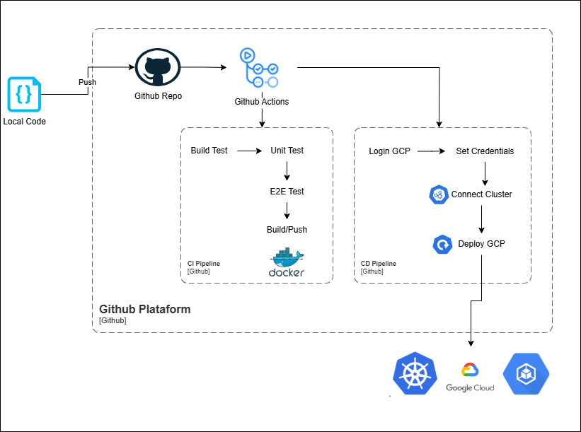

# 🚀 Automatización de la Ejecución/Despliegue en GKE de la Aplicación Django Mediante github actions

## Automatizar el despliegue de la aplicación en Google Kubernetes Engine (GKE).



Este proyecto permite ejecutar una aplicación **Django** tanto en **Docker** como localmente en **Windows** de manera automatizada.
---

## **🛠️ Prerrequisitos**
Antes de ejecutar los scripts, asegúrate de tener instalado lo siguiente:

### **🔹 Requisitos para ejecución local**
- [Python 3.11+](https://www.python.org/downloads/)
- [pip](https://pip.pypa.io/en/stable/installation/)
- [venv (entorno virtual de Python)](https://docs.python.org/3/tutorial/venv.html)

### **🔹 Requisitos para Docker**
- [Docker Desktop](https://www.docker.com/products/docker-desktop)
- [Docker Compose](https://docs.docker.com/compose/install/)

---

## **📌 Ejecución Local (Windows)**
Si deseas ejecutar la aplicación Django directamente en tu máquina, usa el script `run_local.bat`, que:
✅ **Crea el entorno virtual (`.venv`)** si no existe.  
✅ **Activa el entorno virtual automáticamente**.  
✅ **Instala las dependencias de `requirements.txt`** si es necesario.  
✅ **Ejecuta las migraciones** (`makemigrations` y `migrate`).  
✅ **Inicia el servidor Django** en `http://localhost:9095/`.

### **🔹 Pasos para ejecutar en Windows**
1. **Clona el repositorio** (si no lo has hecho):
   ```sh
   git clone https://github.com/tu-repo.git
   cd tu-repo
   ```
2. **Ejecuta el script en CMD o PowerShell**:
   ```sh
   run_local.bat
   ```

**🚀 Resultado:** La aplicación se iniciará automáticamente en `http://localhost:9095/`.

---

## **📌 Ejecución en Docker**
Si deseas ejecutar la aplicación en un contenedor Docker, usa el script `run_docker.bat`, que:
✅ **Construye la imagen Docker de Django**.  
✅ **Detiene y elimina contenedores previos** si existen.  
✅ **Ejecuta la aplicación en modo "detach" (`-d`)**.  

### **🔹 Pasos para ejecutar en Docker**
1. **Clona el repositorio** (si no lo has hecho):
   ```sh
   git clone https://github.com/tu-repo.git
   cd tu-repo
   ```
2. **Ejecuta el script `run_docker.bat`** en la terminal (CMD o PowerShell):
   ```sh
   run_docker.bat
   ```
3. **Verifica que el contenedor está corriendo**:
   ```sh
   docker ps
   ```
4. **Accede a la aplicación en el navegador**:
   ```
   http://localhost:9095/
   ```

---

## **📌 Contribuir**
Si deseas mejorar este proyecto, ¡siéntete libre de hacer un **pull request** o reportar issues! 🎉

---

## **📌 Licencia**
Este proyecto está bajo la licencia **MIT**.

---
🚀 **¡Listo! Ahora puedes ejecutar Django localmente o con Docker de forma automática!** 🚀


